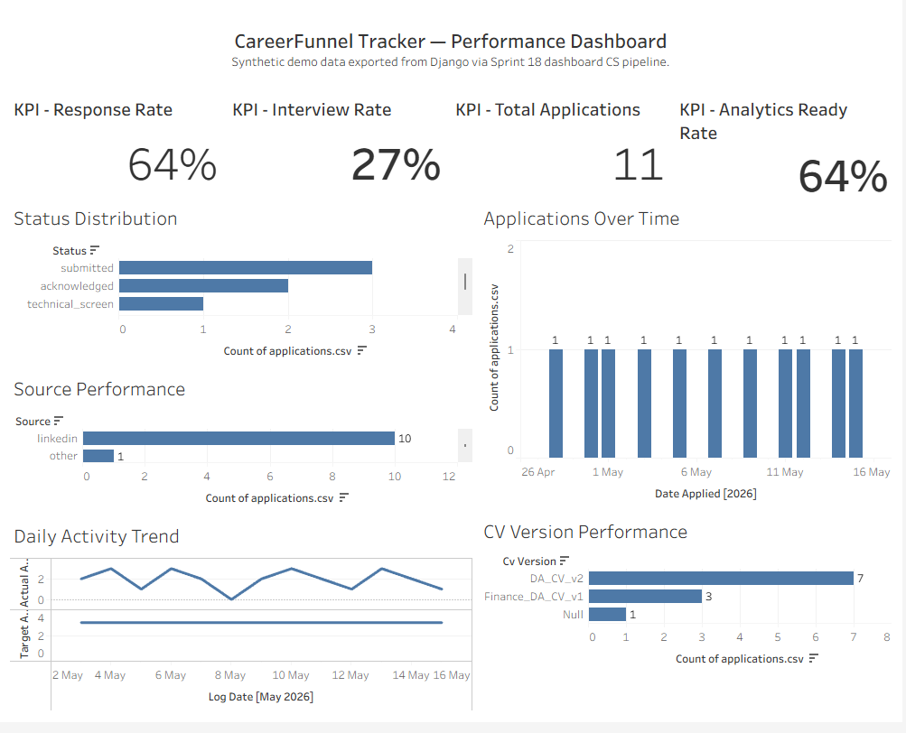
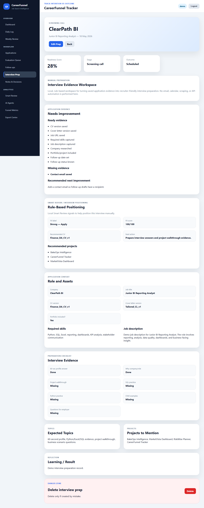

# CareerFunnel Tracker

CareerFunnel Tracker is a Django portfolio analytics product that turns job-search activity into explainable funnel metrics, data-quality signals, and reviewer-ready evidence for Data Analyst, BI Analyst, Reporting Analyst, Analytics Engineer, Junior Data Engineer, and FinTech analytics roles.

## Live Demo Status

Deployment is conditional and not yet verified. This README does not claim a live hosted demo, demo login, production configuration, or public customer usage. If a deployment is added later, it should be verified separately and documented with the exact URL and environment assumptions.

## Current Sprint Position

Sprints **52-59** are complete on `main`.

Current verified baseline: **771 tests passing**.

Latest completed tag: `sprint-59-final-career-intelligence-workflow-complete`.

Earlier sprint families (25-51) remain merged on `main`, including CV Tailoring Claude Enhancement (34), Interview + Email Workflow Polish (35), Weekly Risk / Final Operating System Polish (36), premium SaaS shell and reporting (37-40), Skill Intelligence Dashboard (41-51), and premium component polish (52 Phase 2-3). Evidence for each sprint family is indexed in `docs/evidence/evidence_index.md`.

GitHub Actions should be checked manually before external publishing if required.

This README does not claim Gmail API integration, OAuth, web scraping, auto-apply workflows, automatic saving, calendar integration, a live SaaS deployment, production users, automatic email sending, automatic application status updates, automatic interview prep creation, final CV generation, or cover letter body generation.

## Career Intelligence Pipeline (Sprints 52-59)

Sprints 52-59 deliver a completed, read-only Career Intelligence pipeline on `main`. The flow is:

```text
PPTX / AI Capability Framework
-> AI Readiness Scoring
-> Job-to-AI Capability Matching
-> Learning Recommendations
-> Career Readiness Dashboard
-> Career Strategy Action Plan / Progress Tracking
-> Final Career Intelligence Workflow
```

Key local platform routes (login required):

| Stage | Route |
| --- | --- |
| PPTX / AI Capability Framework | `/skills/ai-capability-framework/` |
| AI Readiness Scoring | `/skills/ai-readiness-report/` |
| Job-to-AI Capability Matching | `/skills/job-ai-capability-match/` |
| Learning Recommendations | `/skills/learning-recommendations/` |
| Career Readiness Dashboard | `/skills/career-readiness-dashboard/` |
| Career Strategy Action Plan | `/skills/career-strategy-action-plan/` |
| Final Career Intelligence Workflow | `/skills/final-career-intelligence-workflow/` |

The Sprint 53-59 intelligence pipeline is **deterministic, rule-based, manual, advisory, and evidence-based**. It uses portfolio baseline and sample inputs. It does **not** use external AI APIs. It does **not** call OpenAI or Claude. It does **not** scrape jobs. It does **not** auto-apply. It does **not** send emails. It does **not** integrate with Gmail or Calendar. It does **not** claim live SaaS users, customers, billing, subscriptions, or production deployment.

Evidence: `docs/evidence/final_release_review_sprint_52_59.md`, plus per-sprint docs under `docs/evidence/sprint_5*.md`.

## Business Problem

Job-search activity quickly becomes fragmented across job boards, spreadsheets, CV versions, follow-up reminders, and interview notes. That makes it hard to answer basic reporting questions:

- Which sources produce stronger responses?
- Which CV versions are associated with better outcomes?
- Where are applications stalling or being rejected?
- Which records are too incomplete for reliable analysis?
- What should be reviewed next?

CareerFunnel Tracker treats the job search as a small analytics domain. It shows how operational records can be converted into governed metrics, quality warnings, and evidence that a reviewer can inspect.

## What The Platform Does

- Tracks applications, sources, statuses, CV versions, follow-up dates, job descriptions, required skills, interviews, notes, daily activity, and weekly reviews.
- Calculates funnel metrics, source performance, CV version performance, rejection patterns, weekly trends, application quality, and data quality readiness.
- Provides rule-based decision support for job-posting fit review, next actions, follow-up drafting, interview prep, and quality warnings.
- Exports workbook evidence for review, backup, and BI-style analysis.
- Documents metric definitions, analytics lineage, sprint evidence, and limitations.

### Recruiter email workflow (Sprint 29)

On Application Detail, manually imported recruiter emails support a rule-based, advisory-only workflow:

```text
Manual recruiter email import -> rule-based action summary -> recruiter communication context -> interview-prep recommendation -> user-controlled manual action
```

Implemented surfaces:

- **Recruiter Email Actions** -- needs reply, reply status, action due, suggested status (suggestion only), interview/screening signal
- **Recruiter Communication Context** -- latest recruiter email, date received, requires reply, manual follow-up guidance
- **Interview Prep Recommended** -- contextual prompt and **Create Interview Prep** link when `matched_signals` contains interview or screening language

This remains manual, rule-based, and advisory only. The repository does not implement or claim Gmail, OAuth, inbox sync, automatic email sending, automatic application status mutation, automatic interview prep creation, or external AI integration. Evidence: `docs/evidence/sprint_29_recruiter_email_workflow_enhancements.md`.

Sprint **35** extends this path with clearer cross-links between Application Detail, recruiter email import/detail, interview prep (including `?application=` pre-fill), and the Application AI Pack — still manual and advisory only. Evidence: `docs/evidence/sprint_35_interview_email_workflow_polish.md`.

## How to review this project

CareerFunnel Tracker is a **local Django portfolio project** for one job seeker. It turns manually logged applications, follow-ups, interviews, and reviews into explainable funnel metrics, data-quality signals, and reviewer-ready evidence. The workflow is **manual, advisory, deterministic, and evidence-based** - not a live SaaS product.

**Implemented manual workflow (high level):**

- Job and application tracking with statuses, sources, CV versions, and save-quality warnings.
- Funnel metrics, exports, and data-quality reporting from authenticated records.
- Rule-based decision support (fit review, follow-ups, interview prep handoffs) without automatic submission.
- Skill Intelligence Dashboard at `/skill-gaps/` with saved skill gaps plus read-only advisory sections: action plan, learning plan, evidence readiness, portfolio evidence mapping, interview story mapping, and CV bullet mapping.
- Career Intelligence pipeline (Sprints 53-59) at `/skills/` routes: AI Capability Framework, AI Readiness Report, Job-to-AI Capability Match, Learning Recommendations, Career Readiness Dashboard, Career Strategy Action Plan, and Final Career Intelligence Workflow.
- Career Evidence OS (markdown + dashboard viewer) for portfolio and recruiter review.

**Claim safety - deliberately not implemented:**

- No auto-apply, auto-send, or automatic application status updates.
- No Gmail, Calendar, OAuth, inbox sync, or scraping.
- No automatic CV rewriting, automatic interview prep generation, or automatic skill-gap creation.
- No fake AI/ML prediction claims; optional Claude paths are advisory and fall back to rule-based logic when not configured.
- No live SaaS users, production deployment claims, billing, or subscription claims.

Evidence index: `docs/evidence/evidence_index.md`. Final release review: `docs/evidence/final_release_review_sprint_52_59.md`. Sprint 51 reviewer polish: `docs/evidence/sprint_51_final_reviewer_walkthrough_polish.md`.

## Five-Minute Reviewer Path

1. Open the dashboard (`/dashboard/`) and read the reviewer walkthrough note, then scan today signals and pipeline health.
2. Review the Evaluation Queue for opportunities that need fit checks or conversion into applications.
3. Open Funnel Metrics and inspect weekly trend, source performance, CV version performance, and rejection patterns.
4. Open **Skill Intelligence Dashboard** at `/skill-gaps/` and walk the manual action plan through CV bullet mapping sections (all read-only).
5. Walk the **Career Intelligence pipeline** (Sprints 53-59) in order: `/skills/ai-capability-framework/` -> `/skills/ai-readiness-report/` -> `/skills/job-ai-capability-match/` -> `/skills/learning-recommendations/` -> `/skills/career-readiness-dashboard/` -> `/skills/career-strategy-action-plan/` -> `/skills/final-career-intelligence-workflow/`.
6. Create or edit an application and observe the save-quality warnings for analytics-critical gaps.
7. Open the Data Quality Report and connect the warnings back to reporting impact.
8. Review `docs/analytics/metric_definitions.md`, `docs/analytics/analytics_lineage.md`, and `docs/evidence/evidence_index.md` for the supporting evidence trail.

### Career Evidence reviewer path (Sprint 23)

After the core tracker walkthrough above, use this path for the Career Evidence OS:

1. Read `docs/evidence/career_evidence_walkthrough.md` for purpose, V1-V6 flow, and claims boundaries.
2. Open **Career Evidence** at `/dashboard/career-evidence/` (local dev server; login required).
3. Inspect the four dashboard surfaces: overview, Project Evidence (V1), Job-Fit Matrix (V2), and Recruiter Pack (V3).
4. Compare UI content to markdown under `docs/career_evidence/` (`01_project_evidence_report.md`, `02_job_fit_matrix.md`, `03_recruiter_evidence_pack.md`).
5. Review Playwright screenshot evidence in `docs/screenshots/career_evidence/` (V5).
6. Optional: read `docs/notion/README.md` for V6 metadata-only Notion sync (no runtime dependency on Notion).

Regenerate V1-V3 markdown from the repository root when evidence changes materially; see `docs/career_evidence/README.md`.

## Career Evidence OS

The **Career Evidence OS** is a local, repository-derived evidence layer for portfolio and recruiter review. It does not add external AI, live deployment claims, or job-search automation. Tools use the Python standard library and existing repo paths only.

| Version | Deliverable | What reviewers see |
| --- | --- | --- |
| **V1** | Project Evidence Report | Inventory of docs, tests, templates, screenshots, and Git context (`docs/career_evidence/01_project_evidence_report.md`) |
| **V2** | Job-Fit Matrix | Requirement-to-repository mapping with evidence strength (`docs/career_evidence/02_job_fit_matrix.md`) |
| **V3** | Recruiter Evidence Pack | CV bullets, LinkedIn summary, and interview points traced to V1/V2 (`docs/career_evidence/03_recruiter_evidence_pack.md`) |
| **V4** | Dashboard UI | Authenticated pages that render the markdown evidence for browser review (`/dashboard/career-evidence/`) |
| **V5** | Playwright screenshots | Curated PNGs in `docs/screenshots/career_evidence/` (local capture; not production monitoring) |
| **V6** | Notion sync (optional) | Metadata/status upsert only; see `docs/notion/README.md` |

Evidence flow: generate **V1 -> V2 -> V3** markdown with `tools/`, review in **V4**, refresh **V5** screenshots when UI or content changes, optionally run **V6** to mirror status in Notion. Full walkthrough: `docs/evidence/career_evidence_walkthrough.md`. Index: `docs/evidence/evidence_index.md` (Sprint 23 section).

## Curated Screenshot Gallery

The curated screenshot set was refreshed after Sprint 21 UI polish using real local browser captures. It remains reviewer-facing evidence, not a live deployment claim.


Dashboard overview showing the project as a reviewer-friendly tracker rather than a raw admin tool.


Evaluation Queue for roles that have been found or fit-checked and need a deliberate next step.


Job Posting Analyzer conversion bridge that pre-fills an Add Application form for user review before saving.


Funnel Metrics weekly trend using Monday-starting weekly buckets for applications, responses, and response rate.


Post-save advisory warnings for analytics-critical gaps such as missing source detail, CV version, job description, or required skills.


Data Quality Report showing how missing fields affect downstream analytics trust.



Visual analytics dashboard evidence showing Sprint 18 BI-style reporting from dashboard-ready synthetic exports.



Interview Evidence Workspace showing Sprint 19 interview preparation evidence linked to application readiness and Smart Review positioning.

## Key Analytics Modules

- **Funnel Metrics:** total applications, response rate, interview rate, offer rate, stage breakdown, daily target progress, and weekly trend.
- **Source ROI:** source-level outcome performance for applications, responses, interviews, and offers. The term ROI is used as channel performance, not financial return.
- **CV Version Performance:** directional comparison of CV versions by responses, interviews, offers, and rejections.
- **Rejection Pattern Analysis:** rejection counts, auto-rejection rates, source patterns, CV-version patterns, seniority risk, and recommended actions.
- **Application Quality Report:** record-level completeness checks for fields needed by later reporting.
- **Data Quality Report:** analytics-ready rate, quality score, missing-field counts, checks, cleanup actions, and analytics impact notes.
- **Export Centre:** workbook exports for applications, daily logs, weekly reviews, interview prep, notes, and the full tracker.

## BI / Visual Analytics Evidence

Sprint 18 adds dashboard CSV exports at `dashboards/data/applications.csv` and `dashboards/data/daily_logs.csv` for synthetic demo data only. Local Tableau evidence is stored in `dashboards/tableau/careerfunnel_sprint18_tableau_workbook.twbx`, with screenshots at `docs/evidence/screenshots/sprint-18-performance-dashboard.png` and `docs/evidence/screenshots/sprint-18-quality-dashboard.png`.

Funnel Metrics now includes one Chart.js weekly trend chart, with screenshot evidence at `docs/evidence/screenshots/sprint-18-chartjs-weekly-trend.png`. Chart data is rendered safely with Django `json_script`, and the existing Weekly Trend table remains available. Tableau evidence is local workbook plus screenshots only unless a Tableau Public URL is later verified.

## Interview Evidence Workspace

Sprint 19 upgrades the Interview Prep detail page into a rule-based Interview Evidence Workspace. It uses existing `InterviewPrep`, `JobApplication`, application evidence readiness, and Smart Review logic to surface ready evidence, missing evidence, recommended next improvement, recommended CV, recommended projects, required skills, job description, and the manual preparation checklist.

Screenshot evidence is stored at `docs/evidence/screenshots/sprint-19-interview-evidence-workspace.png`. This workspace is local, rule-based, and manually used by the user; it does not perform interview automation or external AI/API actions.

## Technical Decisions

### 1. Rule-Based Logic With Optional, Claim-Safe Claude Enhancement

The project uses deterministic service-layer logic for fit review, recommendations, warnings, and CV tailoring guidance. Sprint 34 adds an **optional** Claude semantic path for the CV Tailoring Advisor when configured; it does not replace rule-based analysis and falls back cleanly when the provider is absent or fails. Fit scoring uses a separate mocked-first Claude provider pattern from Sprint 33. The repository does not claim scraping, auto-apply workflows, Gmail integration, Calendar automation, final CV generation, or cover letter body generation. Tests mock external API calls.

### 2. Data-Quality Rule Propagation

Sprint 16 made analytics readiness visible in multiple places without creating separate definitions. The same readiness rule informs metric eligibility, entry-time warnings, and impact reporting, which mirrors an analytics-engineering pattern: define the rule once, then expose it where decisions are made.

### 3. SQLite For Portfolio-Scale Local Analytics

SQLite for portfolio-scale local analytics is a deliberate choice for the current scope. It keeps setup simple, supports local review, and is enough for the project's single-user demonstration scale. A production deployment with real users would need separate environment design, hosting decisions, and database planning.

## Data-Quality Governance Callout

The core governance pattern is `_application_is_analytics_ready` -> `build_save_quality_warnings` -> `analytics_impact_notes`.

- `_application_is_analytics_ready` defines whether an application has the fields needed for reliable analytics.
- `build_save_quality_warnings` surfaces the same readiness concerns at the point of entry after a successful save.
- `analytics_impact_notes` explains how current gaps affect reports such as Source ROI, CV Version Performance, Funnel Metrics, and Data Quality.

This is one analytics-readiness definition propagated across operational entry, metrics, and impact reporting, not three unrelated checks.

## Evidence And Verification

For a portfolio-level evidence map across the user's major GitHub projects, see `docs/career_evidence/portfolio_project_index.md`.

For recruiter-facing portfolio presentation materials, see `docs/career_evidence/portfolio_presentation_pack.md`.

Current verified test count: **771 passing**.

Sprint evidence is stored in `docs/evidence/`, with curated recruiter-facing screenshots copied to `docs/screenshots/curated/`. The main supporting documentation is:

- `docs/analytics/metric_definitions.md`
- `docs/analytics/analytics_lineage.md`
- `docs/evidence/evidence_index.md`
- `docs/evidence/final_release_review_sprint_52_59.md`
- `docs/evidence/sprint_59_final_career_intelligence_workflow.md`
- `docs/evidence/sprint_36_weekly_risk_os_polish.md`
- `docs/evidence/sprint_35_interview_email_workflow_polish.md`
- `docs/evidence/sprint_34_cv_tailoring_claude_enhancement.md`
- `docs/evidence/sprint_29_recruiter_email_workflow_enhancements.md`
- `docs/evidence/career_evidence_walkthrough.md`
- `docs/career_evidence/README.md`
- `DEVELOPMENT.md` for the previous internal/development README preserved during Sprint 17A

### Assisted Intake Evidence

The assisted intake workflow is documented as a manual, approval-based, rule-based path from job-posting review to tracker-ready application evidence. It does not claim scraping, auto-apply, external AI/API integration, Gmail, Calendar automation, or live SaaS usage.

- Workflow evidence: `docs/evidence/assisted_job_intake_workflow.md`
- Field audit: `docs/evidence/assisted_job_intake_field_audit.md`
- Field decision plan: `docs/evidence/assisted_intake_field_decision_plan.md`
- Reviewer path: `docs/evidence/assisted_intake_reviewer_path.md`

Recommended verification commands:

```bash
python manage.py test
ruff check .
python manage.py check
python manage.py makemigrations --dry-run
python manage.py test tests.test_career_evidence_audit tests.test_career_job_fit_matrix tests.test_career_recruiter_pack tests.test_career_evidence_views tests.test_career_evidence_screenshot_config tests.test_notion_sync_config
```

## Tech Stack

- Python
- Django
- SQLite
- Django Templates
- HTML, CSS, and JavaScript
- OpenPyXL
- Ruff
- Git

## Public ZIP Export

To share a clean copy of the repository without local or private files, prefer Git archive from the repository root:

```bash
git archive --format=zip HEAD -o careerfunnel-tracker-public.zip
```

This is safer than manually zipping the project folder. Manual ZIPs often include `.git/`, `.env`, `db.sqlite3`, `.idea/`, `.venv/`, `.ruff_cache/`, `__pycache__/`, `staticfiles/`, and other local or private files.

## Local Setup

```bash
python -m venv .venv
```

```powershell
.venv\Scripts\activate
```

```bash
pip install -r requirements.txt
python manage.py migrate
python manage.py seed_demo_data
python manage.py runserver
```

Open the local development server at:

```text
http://127.0.0.1:8000/
```

## Repository Guide

- `apps/applications/` contains application tracking workflows and save-quality warning integration.
- `apps/metrics/` contains funnel, source, CV, rejection, quality, weekly trend, and data-quality reporting logic.
- `apps/job_intelligence/` contains rule-based role-fit and job-posting review workflows.
- `apps/skills/` contains the Sprint 53-59 Career Intelligence pipeline services and read-only report pages.
- `apps/exports/` contains workbook export flows.
- `docs/analytics/` contains metric definitions and analytics lineage.
- `docs/evidence/` contains sprint evidence and historical screenshots.
- `docs/career_evidence/` contains V1-V3 Career Evidence markdown generated from the repository.
- `docs/screenshots/career_evidence/` contains Career Evidence dashboard screenshot evidence (Sprint 23E).
- `docs/screenshots/curated/` contains the recruiter-facing screenshot set used by this README.
- `docs/notion/README.md` documents optional V6 Notion metadata sync (Sprint 23F).
- `DEVELOPMENT.md` preserves the previous internal/development README.

## What This Project Demonstrates

- Django application structure with authenticated, user-specific records.
- Service-layer analytics that turn operational records into BI-style reporting.
- Metric governance, analytics lineage, and data-quality propagation.
- Evidence-based delivery with sprint screenshots, documentation, and tests.
- Practical trade-off communication for analytics and reporting roles.
- Recruiter-readable positioning without overstating product maturity.

## What Is Not Claimed

- No verified live deployment URL is claimed.
- No verified Tableau Public URL is claimed.
- No Power BI implementation is claimed yet.
- No real/private data is exported through the dashboard CSV pipeline.
- No real customers, SaaS business, billing system, or production user base is claimed.
- No final CV generation is claimed; the CV Tailoring Advisor suggests angles and evidence pointers only.
- No cover letter body generation is claimed; only cover-letter **themes** are suggested.
- No automatic application submission is claimed.
- No automatic application status updates from recruiter email classification are claimed.
- No automatic interview prep creation is claimed.
- No Gmail integration, Calendar integration, or OAuth integration is claimed.
- No auto-send, auto-apply, or automatic submission workflows are claimed.
- No auto-apply workflow is claimed.
- Claude semantic enhancement is not claimed to run on every request — it is optional when configured, with rule-based fallback otherwise.
- No interview automation or external AI/API interview assistant is claimed.
- No email, calendar, scraping, auto-apply, background polling, or background automation is claimed.
- No scientific CV A/B testing is claimed; CV Version Performance is directional reporting.
- No financial return calculation is claimed; Source ROI means source outcome performance.
- No production database architecture is claimed; SQLite is used for portfolio-scale local review.

## What's Next

- Verify any future deployment separately before adding a live demo URL.
- Continue improving reviewer evidence with current screenshots and concise walkthrough notes.
- Consider status-history and stage-transition modeling for stronger funnel analysis.
- Expand analytics documentation when new reporting surfaces are added.
