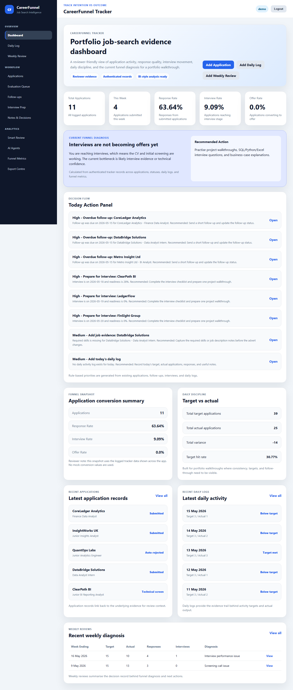
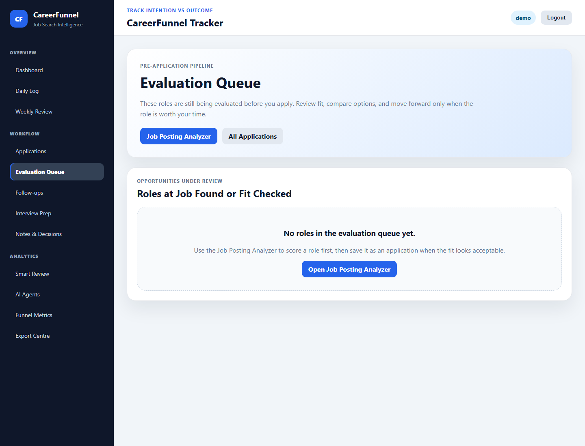
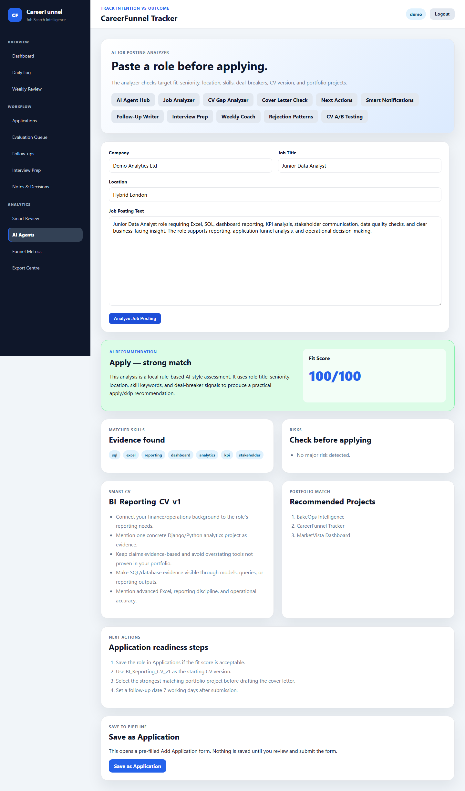
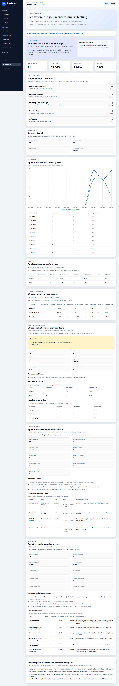
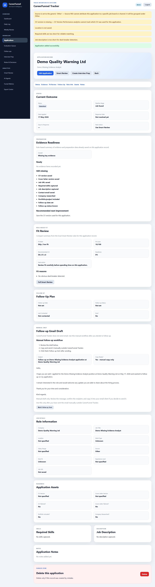
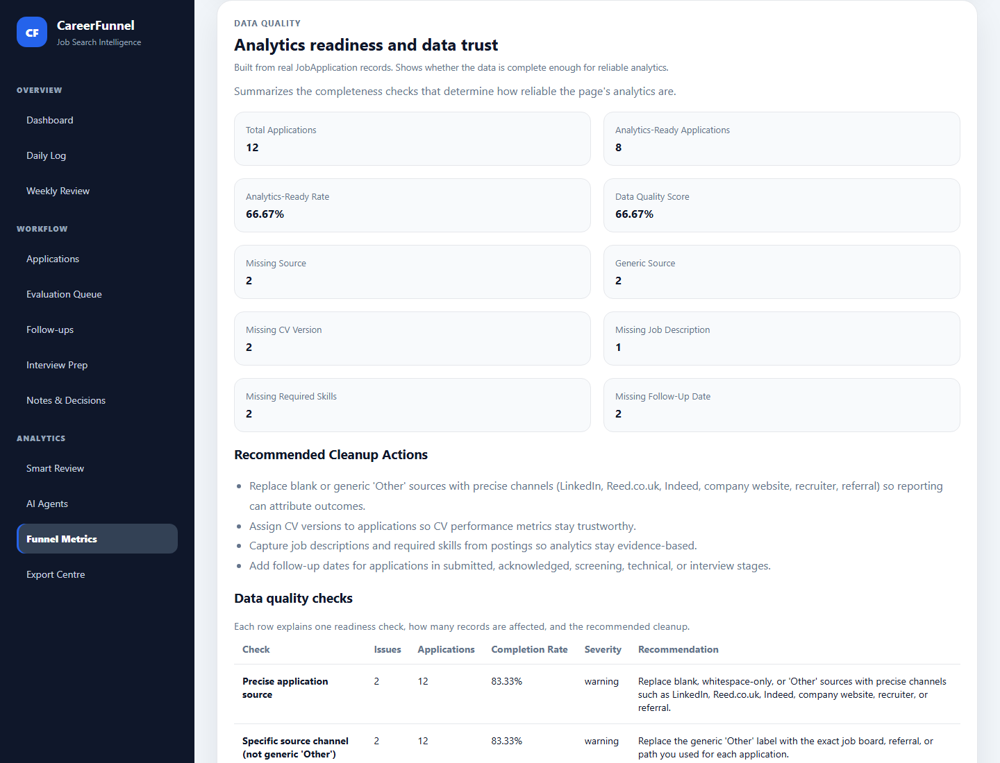

# CareerFunnel Tracker

CareerFunnel Tracker is a Django portfolio analytics product that turns job-search activity into explainable funnel metrics, data-quality signals, and reviewer-ready evidence for Data Analyst, BI Analyst, Reporting Analyst, Analytics Engineer, Junior Data Engineer, and FinTech analytics roles.

## Live Demo Status

Deployment is conditional and not yet verified. This README does not claim a live hosted demo, demo login, production configuration, or public customer usage. If a deployment is added later, it should be verified separately and documented with the exact URL and environment assumptions.

## Current Sprint Position

Sprint 17 is complete and tagged. Sprint 18 work on `sprint-18-visualization` adds dashboard-ready synthetic CSV exports, local Tableau evidence, and one Chart.js weekly trend visualization while keeping deployment and public-hosting claims unverified.

## Business Problem

Job-search activity quickly becomes fragmented across job boards, spreadsheets, CV versions, follow-up reminders, and interview notes. That makes it hard to answer basic reporting questions:

- Which sources produce stronger responses?
- Which CV versions are associated with better outcomes?
- Where are applications stalling or being rejected?
- Which records are too incomplete for reliable analysis?
- What should be reviewed next?

CareerFunnel Tracker treats the job search as a small analytics domain. It shows how operational records can be converted into governed metrics, quality warnings, and evidence that a reviewer can inspect.

## What The Platform Does

- Tracks applications, sources, statuses, CV versions, follow-up dates, job descriptions, required skills, interviews, notes, daily activity, and weekly reviews.
- Calculates funnel metrics, source performance, CV version performance, rejection patterns, weekly trends, application quality, and data quality readiness.
- Provides rule-based decision support for job-posting fit review, next actions, follow-up drafting, interview prep, and quality warnings.
- Exports workbook evidence for review, backup, and BI-style analysis.
- Documents metric definitions, analytics lineage, sprint evidence, and limitations.

## Five-Minute Reviewer Path

1. Open the dashboard and scan the headline job-search status.
2. Review the Evaluation Queue for opportunities that need fit checks or conversion into applications.
3. Open Funnel Metrics and inspect weekly trend, source performance, CV version performance, and rejection patterns.
4. Create or edit an application and observe the save-quality warnings for analytics-critical gaps.
5. Open the Data Quality Report and connect the warnings back to reporting impact.
6. Review `docs/analytics/metric_definitions.md`, `docs/analytics/analytics_lineage.md`, and `docs/evidence/evidence_index.md` for the supporting evidence trail.

## Curated Screenshot Gallery



Dashboard overview showing the project as a reviewer-friendly tracker rather than a raw admin tool.



Evaluation Queue for roles that have been found or fit-checked and need a deliberate next step.



Job Posting Analyzer conversion bridge that pre-fills an Add Application form for user review before saving.



Funnel Metrics weekly trend using Monday-starting weekly buckets for applications, responses, and response rate.



Post-save advisory warnings for analytics-critical gaps such as missing source detail, CV version, job description, or required skills.



Data Quality Report showing how missing fields affect downstream analytics trust.

## Key Analytics Modules

- **Funnel Metrics:** total applications, response rate, interview rate, offer rate, stage breakdown, daily target progress, and weekly trend.
- **Source ROI:** source-level outcome performance for applications, responses, interviews, and offers. The term ROI is used as channel performance, not financial return.
- **CV Version Performance:** directional comparison of CV versions by responses, interviews, offers, and rejections.
- **Rejection Pattern Analysis:** rejection counts, auto-rejection rates, source patterns, CV-version patterns, seniority risk, and recommended actions.
- **Application Quality Report:** record-level completeness checks for fields needed by later reporting.
- **Data Quality Report:** analytics-ready rate, quality score, missing-field counts, checks, cleanup actions, and analytics impact notes.
- **Export Centre:** workbook exports for applications, daily logs, weekly reviews, interview prep, notes, and the full tracker.

## BI / Visual Analytics Evidence

Sprint 18 adds dashboard CSV exports at `dashboards/data/applications.csv` and `dashboards/data/daily_logs.csv` for synthetic demo data only. Local Tableau evidence is stored in `dashboards/tableau/careerfunnel_sprint18_tableau_workbook.twbx`, with screenshots at `docs/evidence/screenshots/sprint-18-performance-dashboard.png` and `docs/evidence/screenshots/sprint-18-quality-dashboard.png`.

Funnel Metrics now includes one Chart.js weekly trend chart, with screenshot evidence at `docs/evidence/screenshots/sprint-18-chartjs-weekly-trend.png`. Chart data is rendered safely with Django `json_script`, and the existing Weekly Trend table remains available. Tableau evidence is local workbook plus screenshots only unless a Tableau Public URL is later verified.

## Technical Decisions

### 1. Rule-Based Logic Instead Of Fake AI/LLM Claims

The project uses deterministic service-layer logic for fit review, recommendations, warnings, and generated helper text. This keeps the behavior explainable, testable, and honest. The repository does not claim external AI, LLM integration, scraping, auto-apply workflows, Gmail integration, or Calendar automation.

### 2. Data-Quality Rule Propagation

Sprint 16 made analytics readiness visible in multiple places without creating separate definitions. The same readiness rule informs metric eligibility, entry-time warnings, and impact reporting, which mirrors an analytics-engineering pattern: define the rule once, then expose it where decisions are made.

### 3. SQLite For Portfolio-Scale Local Analytics

SQLite for portfolio-scale local analytics is a deliberate choice for the current scope. It keeps setup simple, supports local review, and is enough for the project's single-user demonstration scale. A production deployment with real users would need separate environment design, hosting decisions, and database planning.

## Data-Quality Governance Callout

The core governance pattern is `_application_is_analytics_ready` -> `build_save_quality_warnings` -> `analytics_impact_notes`.

- `_application_is_analytics_ready` defines whether an application has the fields needed for reliable analytics.
- `build_save_quality_warnings` surfaces the same readiness concerns at the point of entry after a successful save.
- `analytics_impact_notes` explains how current gaps affect reports such as Source ROI, CV Version Performance, Funnel Metrics, and Data Quality.

This is one analytics-readiness definition propagated across operational entry, metrics, and impact reporting, not three unrelated checks.

## Evidence And Verification

Current verified test count: **244 passing**.

Sprint evidence is stored in `docs/evidence/`, with curated recruiter-facing screenshots copied to `docs/screenshots/curated/`. The main supporting documentation is:

- `docs/analytics/metric_definitions.md`
- `docs/analytics/analytics_lineage.md`
- `docs/evidence/evidence_index.md`
- `DEVELOPMENT.md` for the previous internal/development README preserved during Sprint 17A

Recommended verification commands:

```bash
python manage.py test
ruff check .
python manage.py check
python manage.py makemigrations --dry-run
```

## Tech Stack

- Python
- Django
- SQLite
- Django Templates
- HTML, CSS, and JavaScript
- OpenPyXL
- Ruff
- Git

## Local Setup

```bash
python -m venv .venv
```

```powershell
.venv\Scripts\activate
```

```bash
pip install -r requirements.txt
python manage.py migrate
python manage.py seed_demo_data
python manage.py runserver
```

Open the local development server at:

```text
http://127.0.0.1:8000/
```

## Repository Guide

- `apps/applications/` contains application tracking workflows and save-quality warning integration.
- `apps/metrics/` contains funnel, source, CV, rejection, quality, weekly trend, and data-quality reporting logic.
- `apps/job_intelligence/` contains rule-based role-fit and job-posting review workflows.
- `apps/exports/` contains workbook export flows.
- `docs/analytics/` contains metric definitions and analytics lineage.
- `docs/evidence/` contains sprint evidence and historical screenshots.
- `docs/screenshots/curated/` contains the recruiter-facing screenshot set used by this README.
- `DEVELOPMENT.md` preserves the previous internal/development README.

## What This Project Demonstrates

- Django application structure with authenticated, user-specific records.
- Service-layer analytics that turn operational records into BI-style reporting.
- Metric governance, analytics lineage, and data-quality propagation.
- Evidence-based delivery with sprint screenshots, documentation, and tests.
- Practical trade-off communication for analytics and reporting roles.
- Recruiter-readable positioning without overstating product maturity.

## What Is Not Claimed

- No verified live deployment URL is claimed.
- No verified Tableau Public URL is claimed.
- No Power BI implementation is claimed yet.
- No real/private data is exported through the dashboard CSV pipeline.
- No real customers, SaaS business, billing system, or production user base is claimed.
- No external AI, LLM, scraping, auto-apply, Gmail, or Calendar integration is claimed.
- No scientific CV A/B testing is claimed; CV Version Performance is directional reporting.
- No financial return calculation is claimed; Source ROI means source outcome performance.
- No production database architecture is claimed; SQLite is used for portfolio-scale local review.

## What's Next

- Verify any future deployment separately before adding a live demo URL.
- Continue improving reviewer evidence with current screenshots and concise walkthrough notes.
- Consider status-history and stage-transition modeling for stronger funnel analysis.
- Expand analytics documentation when new reporting surfaces are added.
