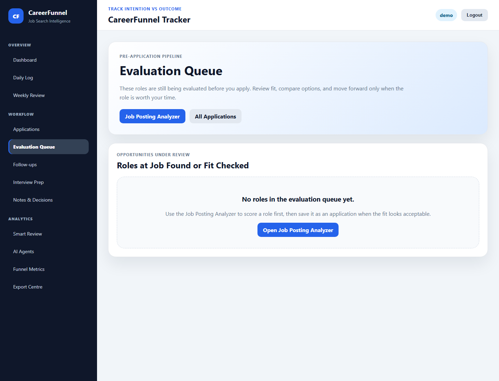
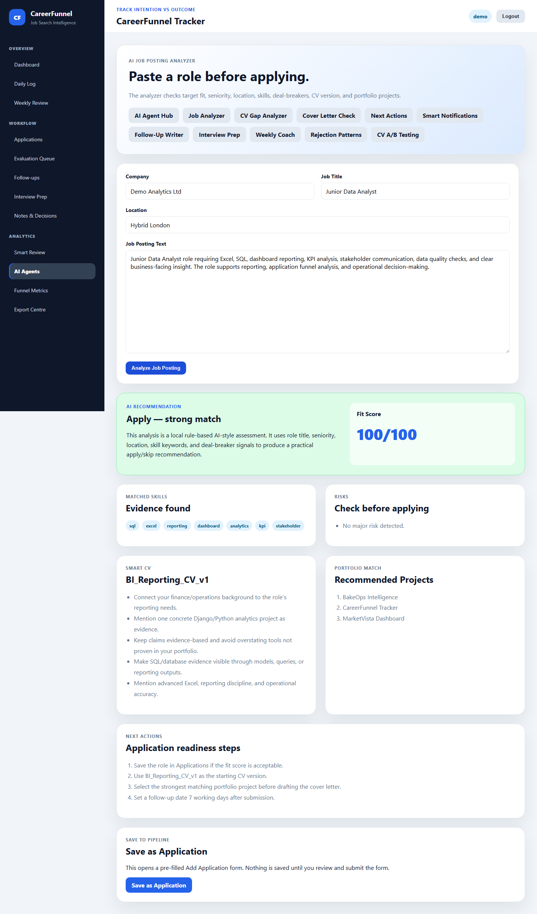
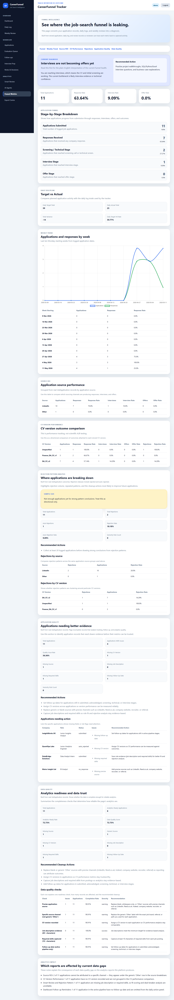
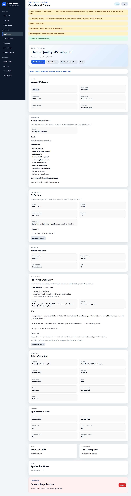
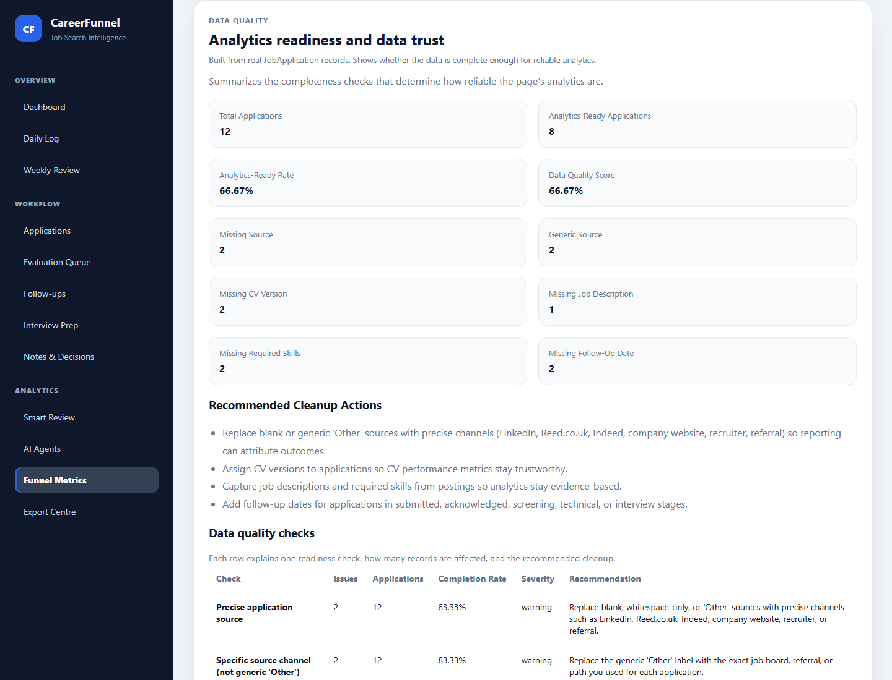
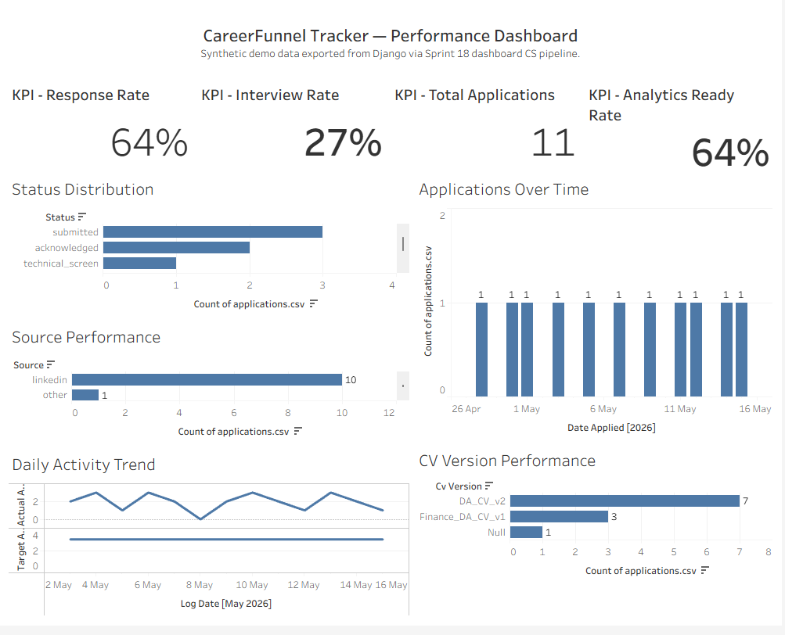
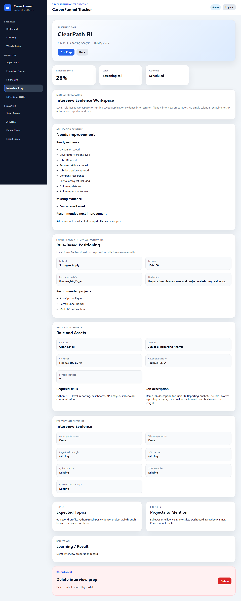

<div align="center">

# CareerFunnel Tracker

**A Django analytics platform with a controlled, evaluated AI engineering layer.**

Turns a single-user job search into governed metrics, data-quality signals, and reviewer-ready evidence.

<br>


<br>

[Reviewer Path](#five-minute-reviewer-path) | [AI Engineering](#ai-engineering-evidence) | [Evaluation Evidence](#evaluation-evidence) | [Architecture](#technical-decisions) | [Setup](#local-setup)

</div>

---

## At a glance

| | |
| :--- | :--- |
| **What it is** | Local Django portfolio application, single user |
| **Two layers** | Deterministic analytics core + controlled AI engineering layer |
| **Verified tests** | 3,005 passing at Sprint 124 closure |
| **CI** | GitHub Actions verified on `main` @ `d3f0ea57` |
| **Completion tag** | `sprint-124-ai-experience-evidence-ui-complete` |
| **Live-provider state** | Configuration-gated, **non-live by default** |
| **Not claimed** | Live deployment, production users, autonomous agents, enterprise RAG |

> **Scope statement.** This is a portfolio-scale local application. No live hosted demo, production deployment, public usage, autonomous job-application system, enterprise RAG platform, production vector database, or production AI service is claimed.

---

## Five-Minute Reviewer Path

The fastest route to verifying everything below, in order.

| # | Step | Where |
| :-- | :--- | :--- |
| 1 | Career Command Centre and current workflow | `/dashboard/` |
| 2 | Career Evidence overview | `/dashboard/career-evidence/` |
| 3 | **AI Engineering Evidence** - execution types, evaluation, claim boundaries, provider boundary, live-canary qualification | `/dashboard/career-evidence/ai-engineering/` |
| 4 | Skill Intelligence Dashboard | `/skill-gaps/` |
| 5 | Career Intelligence pipeline | `/skills/` |
| 6 | Funnel Metrics, Data Quality, workflow boundaries | `/dashboard/` |
| 7 | Metric definitions, analytics lineage, evidence index | `docs/analytics/`, `docs/evidence/` |
| 8 | Test and CI evidence, Sprint 124 completion tag | repository |

---

## AI Engineering Evidence

The AI layer sits **on top of** deterministic, inspectable application and skill evidence - it never replaces it.

```text
Saved application / skill evidence
 v
Deterministic context assembly / retrieval
 v
Controlled provider boundary
 v
Validated model output
 v
Claim-safety / evidence-alignment controls
 v
Human review
 v
Manual action or save
```

### Execution types are separated, not blended

Each capability is labelled by how it actually executes - rule-based logic is never presented as AI.

| Execution type | What it covers | Boundary |
| :--- | :--- | :--- |
| **Deterministic / rule-based** | Analytics, evidence checks, claim-safety rules, Career Intelligence, advisory paths | No external API calls |
| **Retrieval / RAG** | Small-scale private evidence retrieval, cached embeddings, deterministic evaluation | No production vector database |
| **Bounded read-only tool-calling** | Closed registry, read-only tools, constrained call budgets | Not autonomous agency |
| **LLM-assisted** | Provider-backed assistance | Only when explicit configuration permits |
| **Controlled live canary** | Synthetic, explicitly activated integration evidence | Strict call and cost controls |
| **Human review** | All generated or advisory output | Subject to user review and manual action |

 -> **Authenticated evidence surface:** `/dashboard/career-evidence/ai-engineering/`

<details>
<summary><strong>Controlled provider activation - how live execution is gated</strong></summary>

<br>

Live-provider execution is explicitly configuration-gated:

- **Provider mode is authoritative.** The presence of an API key alone is not sufficient to activate live execution.
- **Some AI paths add their own feature or canary gates** on top of provider mode.
- **Controlled live-evaluation paths require additional explicit activation and confirmation.**
- **Default behaviour remains non-live** unless the required configuration is deliberately enabled.

Provider-backed user-facing AI execution is configuration-gated and remains non-live by default. The deterministic workflow remains fully functional without live-provider activation.

</details>

<details>
<summary><strong>Controlled live-provider canary - exactly what was proven</strong></summary>

<br>

The repository includes controlled live-provider canary evidence using:

| Control | Value |
| :--- | :--- |
| Calls | **1** (single synthetic call) |
| Activation | **Explicit** |
| Call cap | **1** |
| Retries | **0** |
| Cost | **Bounded** |
| Input | **Synthetic only** |

This demonstrates controlled integration under constrained test conditions only.

> It does **not** prove production reliability, continuous live operation, production-scale throughput, or customer-facing availability.

</details>

---

## Evaluation Evidence

> **Read this first.** The following are historical, offline closure evidence from validated repository states. They are **not** production accuracy, reliability, throughput, or customer-performance metrics.

| Evaluation suite | Result | State | Qualification |
| :--- | :--- | :--- | :--- |
| Offline RAG evaluation | **31 / 31 passed** | Sprint 122 validated | Historical closure evidence, not production accuracy |
| Bounded read-only tool-assistant | **81 / 81 passed** | Sprint 122 validated | Historical closure evidence, not production agent performance |
| Offline AI quality lifecycle | **54 / 54 passed** | Sprint 122 validated | Historical closure evidence, not production quality or reliability |

**What passing means:** conformance to defined expected behaviour within version-controlled datasets and repository states.

**What it does not mean:** general correctness, intelligence, model quality, production readiness, deployment readiness, commercial readiness, customer value, production reliability, or production monitoring.

<details>
<summary><strong>Deterministic claim-safety reviewer - version-controlled dataset</strong></summary>

<br>

A **deterministic, rule-based** reviewer checks whether a written claim is supported by recorded evidence. It is **not** a live AI/LLM integration.

| Metric | Count |
| :--- | :--- |
| Total version-controlled cases | 22 |
| Defined risk categories | 20 |
| Conformance cases | 20 |
| Documented known-limitation cases | 2 |

Evidence:
- `docs/evidence/sprint_107_claim_safety_evaluation_report.md`
- `docs/evidence/sprint_107_claim_safety_evaluation_summary.md`
- `docs/evidence/sprint_108_claim_safety_recruiter_evidence_summary.md`
- `docs/evidence/sprint_108_claim_safety_overstatement_guardrails.md`

</details>

---

## The Problem

Job-search activity fragments across job boards, spreadsheets, CV versions, follow-up reminders, and interview notes - making basic reporting questions hard to answer:

- Which sources produce stronger responses?
- Which CV versions are associated with better outcomes?
- Where are applications stalling or being rejected?
- Which records are too incomplete for reliable analysis?
- What should be reviewed next?

CareerFunnel treats the job search as a **small analytics domain** - converting operational records into governed metrics, quality warnings, and inspectable evidence.

### What the platform does

| Capability | Detail |
| :--- | :--- |
| **Tracks** | Applications, sources, statuses, CV versions, follow-ups, job descriptions, required skills, interviews, notes, daily activity, weekly reviews |
| **Calculates** | Funnel metrics, source performance, CV version performance, rejection patterns, weekly trends, application quality, data-quality readiness |
| **Supports** | Rule-based decision support for fit review, next actions, follow-up drafting, interview prep, quality warnings |
| **Exports** | Workbook evidence for review, backup, and BI-style analysis |
| **Documents** | Metric definitions, analytics lineage, sprint evidence, limitations |

---

## Career Intelligence Pipeline

> **Sprints 52-59 are deterministic, rule-based, manual, advisory, and evidence-based.** They use portfolio baseline and sample inputs. They do **not** call external AI APIs, do not scrape, do not auto-apply, and do not send emails.

```text
PPTX / AI Capability Framework
 -> AI Readiness Scoring
 -> Job-to-AI Capability Matching
 -> Learning Recommendations
 -> Career Readiness Dashboard
 -> Career Strategy Action Plan / Progress Tracking
 -> Final Career Intelligence Workflow
```

<details>
<summary><strong>Pipeline routes and screenshot evidence</strong></summary>

<br>

| Stage | Route |
| :--- | :--- |
| AI Capability Framework | `/skills/ai-capability-framework/` |
| AI Readiness Scoring | `/skills/ai-readiness-report/` |
| Job-to-AI Capability Matching | `/skills/job-ai-capability-match/` |
| Learning Recommendations | `/skills/learning-recommendations/` |
| Career Readiness Dashboard | `/skills/career-readiness-dashboard/` |
| Career Strategy Action Plan | `/skills/career-strategy-action-plan/` |
| Final Career Intelligence Workflow | `/skills/final-career-intelligence-workflow/` |

Screenshot evidence: `docs/screenshots/intelligence/` - seven captures covering each stage. These are local reviewer evidence only; they do not claim a hosted demo, production deployment, customers, or external AI API calls.

Evidence: `docs/evidence/final_release_review_sprint_52_59.md`, plus per-sprint docs under `docs/evidence/sprint_5*.md`.

</details>

---

## Screenshots

<details>
<summary><strong>Curated reviewer-facing gallery (8 captures)</strong></summary>

<br>

Refreshed after Sprint 21 UI polish using real local browser captures. Reviewer-facing evidence, not a live deployment claim.


*Dashboard overview - reviewer-friendly tracker rather than a raw admin tool.*


*Evaluation Queue for roles found or fit-checked that need a deliberate next step.*


*Job Posting Analyzer conversion bridge - pre-fills an Add Application form for user review before saving.*


*Funnel Metrics weekly trend using Monday-starting buckets.*


*Post-save advisory warnings for analytics-critical gaps.*


*Data Quality Report showing how missing fields affect downstream analytics trust.*


*BI-style reporting from dashboard-ready synthetic exports.*


*Interview preparation evidence linked to application readiness and Smart Review positioning.*

</details>

---

## Analytics Modules

| Module | What it reports |
| :--- | :--- |
| **Funnel Metrics** | Total applications, response/interview/offer rates, stage breakdown, daily target progress, weekly trend |
| **Source ROI** | Source-level outcome performance - *channel performance, not financial return* |
| **CV Version Performance** | Directional comparison by responses, interviews, offers, rejections |
| **Rejection Pattern Analysis** | Rejection counts, auto-rejection rates, source and CV patterns, seniority risk, recommended actions |
| **Application Quality Report** | Record-level completeness checks for downstream reporting |
| **Data Quality Report** | Analytics-ready rate, quality score, missing-field counts, cleanup actions, impact notes |
| **Export Centre** | Workbook exports for applications, logs, reviews, interview prep, notes, full tracker |

<details>
<summary><strong>BI / visual analytics and Interview Evidence Workspace</strong></summary>

<br>

**BI evidence (Sprint 18).** Dashboard CSV exports at `dashboards/data/` for synthetic demo data only. Local Tableau workbook at `dashboards/tableau/careerfunnel_sprint18_tableau_workbook.twbx` with screenshots under `docs/evidence/screenshots/`. Funnel Metrics includes a Chart.js weekly trend rendered safely via Django `json_script`. Tableau evidence is local workbook plus screenshots only - no Tableau Public URL is claimed.

**Interview Evidence Workspace (Sprint 19).** Rule-based workspace surfacing ready evidence, missing evidence, recommended next improvement, recommended CV, recommended projects, required skills, job description, and the manual preparation checklist. Local, rule-based, manually used - no interview automation or external AI/API actions.

</details>

---

## Manual Workflow Boundaries

Every user-facing action is manual and approval-based. The system pre-fills and advises; it never submits.

```text
Analyse -> Review -> Approve -> Pre-fill Add Application -> Manual Save
```

<details>
<summary><strong>Recruiter email workflow (Sprint 29) and Application Document Pack (Sprint 60)</strong></summary>

<br>

**Recruiter email workflow.** Manually imported recruiter emails support a rule-based, advisory-only path:

```text
Manual import -> rule-based action summary -> communication context -> interview-prep recommendation -> user-controlled manual action
```

Surfaces: Recruiter Email Actions (needs reply, reply status, action due, suggested status, interview/screening signal), Recruiter Communication Context, and Interview Prep Recommended. Manual, rule-based, advisory only. No Gmail, OAuth, inbox sync, automatic email sending, automatic status mutation, automatic interview prep creation, or external AI integration.

Evidence: `docs/evidence/sprint_29_recruiter_email_workflow_enhancements.md`, `docs/evidence/sprint_35_interview_email_workflow_polish.md`

**Application Document Pack.** Stores and references externally generated final CV and cover-letter documents. Can save rule-based draft CV tailoring notes and draft cover-letter records for manual review, call preparation, and DOCX/PDF download from saved database text.

```text
Smart Review -> draft documents -> save to pack -> select -> download DOCX/PDF -> manual review before use
```

Manual-review only. No automatic submission, file upload, or Gmail/Calendar/OAuth connection.

Evidence: `docs/evidence/sprint_60_application_document_pack_closure.md`

</details>

---

## Career Evidence OS

A local, repository-derived evidence layer for portfolio and recruiter review. No external AI, live deployment claims, or job-search automation. Tools use the Python standard library and existing repo paths only.

| Version | Deliverable | What reviewers see |
| :--- | :--- | :--- |
| **V1** | Project Evidence Report | Inventory of docs, tests, templates, screenshots, Git context |
| **V2** | Job-Fit Matrix | Requirement-to-repository mapping with evidence strength |
| **V3** | Recruiter Evidence Pack | CV bullets, LinkedIn summary, interview points traced to V1/V2 |
| **V4** | Dashboard UI | Authenticated pages rendering the markdown evidence |
| **V5** | Playwright screenshots | Curated PNGs (local capture, not production monitoring) |
| **V6** | Notion sync *(optional)* | Metadata/status upsert only |

<details>
<summary><strong>Career Evidence reviewer path (Sprint 23)</strong></summary>

<br>

1. Read `docs/evidence/career_evidence_walkthrough.md` for purpose, V1-V6 flow, and claims boundaries.
2. Open **Career Evidence** at `/dashboard/career-evidence/` (local dev server, login required).
3. Inspect the four dashboard surfaces: overview, Project Evidence (V1), Job-Fit Matrix (V2), Recruiter Pack (V3).
4. Compare UI content to markdown under `docs/career_evidence/`.
5. Review Playwright screenshot evidence in `docs/screenshots/career_evidence/` (V5).
6. Optional: `docs/notion/README.md` for V6 metadata-only Notion sync.

Regenerate V1-V3 markdown from the repository root when evidence changes materially - see `docs/career_evidence/README.md`.

</details>

---

## Technical Decisions

<details open>
<summary><strong>1. Controlled LLM provider boundary</strong></summary>

<br>

Live-provider execution is explicitly configuration-gated. **Provider mode is authoritative**, and the presence of an API key alone is not sufficient to activate live execution. Some AI paths add their own feature or canary gates. Controlled live-evaluation paths require additional explicit activation and confirmation.

Optional provider-backed semantic paths exist for CV tailoring guidance and fit scoring. They supplement rather than replace rule-based analysis and fall back cleanly when no provider is configured. All such paths sit behind this boundary.

</details>

<details>
<summary><strong>2. Data-quality rule propagation</strong></summary>

<br>

One analytics-readiness definition propagated across operational entry, metrics, and impact reporting - not three unrelated checks:

```text
_application_is_analytics_ready -> build_save_quality_warnings -> analytics_impact_notes
```

- `_application_is_analytics_ready` defines whether an application has the fields needed for reliable analytics.
- `build_save_quality_warnings` surfaces the same readiness concerns at point of entry after a successful save.
- `analytics_impact_notes` explains how current gaps affect Source ROI, CV Version Performance, Funnel Metrics, and Data Quality.

This mirrors an analytics-engineering pattern: define the rule once, then expose it where decisions are made.

</details>

<details>
<summary><strong>3. SQLite for portfolio-scale local analytics</strong></summary>

<br>

A deliberate choice for the current scope - simple setup, local review, sufficient for single-user demonstration scale. A production deployment with real users would require separate environment design, hosting decisions, and database planning.

</details>

---

## Evidence and Verification

### Verification commands

```bash
python manage.py test
ruff check .
python manage.py check
python manage.py makemigrations --check --dry-run
```

### Current verified evidence

| Item | Value |
| :--- | :--- |
| Automated tests | **3,005 passing** at Sprint 124 closure |
| CI | GitHub Actions verified on `main` @ `d3f0ea578cdca668880401025142378ca467dc25` |
| Completion tag | `sprint-124-ai-experience-evidence-ui-complete` |
| Claim-safety dataset | 22 cases; 20 risk categories; 20 conformance; 2 known limitations |
| AI evaluation | See [Evaluation Evidence](#evaluation-evidence) for qualified Sprint 122 historical offline results |

<details>
<summary><strong>Evidence file index</strong></summary>

<br>

**Claim safety:** `docs/evidence/sprint_107_claim_safety_evaluation_report.md` | `sprint_107_claim_safety_evaluation_summary.md` | `sprint_108_claim_safety_source_of_truth_inventory.md` | `sprint_108_claim_safety_skills_to_evidence_map.md` | `sprint_108_claim_safety_recruiter_evidence_summary.md` | `sprint_108_claim_safety_overstatement_guardrails.md`

**Public hardening (Phase 4A):** `phase4a_current_public_test_log.md` | `phase4a_screenshot_safety_checklist.md` | `phase4a_public_evidence_map.md` | `phase4a_claim_safety_review.md`

**Claim-Safety Reviewer:** Phase 5A planning pack at `docs/ai/claim_safety_reviewer/` (specification only) | Phase 5B evidence at `docs/evidence/sprint_5b_claim_safety_reviewer_mocked.md` | service module `apps/ai_agents/claim_safety_reviewer.py` (rule-based, no live LLM)

**Assisted intake:** `assisted_job_intake_workflow.md` | `assisted_job_intake_field_audit.md` | `assisted_intake_field_decision_plan.md` | `assisted_intake_reviewer_path.md` - manual, approval-based, rule-based only

**Analytics:** `docs/analytics/metric_definitions.md` | `docs/analytics/analytics_lineage.md`

**Index:** `docs/evidence/evidence_index.md`

</details>

---

## Local Setup

```bash
python -m venv .venv
```

```powershell
.venv\Scripts\activate
```

```bash
pip install -r requirements.txt
python manage.py migrate
python manage.py seed_demo_data
python manage.py runserver
```

Open `http://127.0.0.1:8000/`

<details>
<summary><strong>Tech stack and public ZIP export</strong></summary>

<br>

**Stack:** Python | Django | SQLite | Django Templates | HTML/CSS/JavaScript | OpenPyXL | GitHub Actions | Ruff | Git

**Public export.** Prefer Git archive from the repository root:

```bash
git archive --format=zip HEAD -o careerfunnel-tracker-public.zip
```

Safer than manual zipping, which often includes `.git/`, `.env`, `db.sqlite3`, `.idea/`, `.venv/`, `.ruff_cache/`, `__pycache__/`, and `staticfiles/`.

</details>

---

## Repository Guide

| Path | Contains |
| :--- | :--- |
| `apps/applications/` | Application tracking workflows, save-quality warnings |
| `apps/ai_agents/` | Claim-safety, provider-boundary, evaluation, controlled LLM assistance - *historical `ai_agents` naming does not imply autonomous agency* |
| `apps/skill_ledger/` | Private skill evidence, retrieval/RAG, bounded tool-assistant, AI-quality evaluation |
| `apps/dashboard/` | Deterministic Sprint 124 AI engineering evidence contract |
| `apps/metrics/` | Funnel, source, CV, rejection, quality, weekly trend, data-quality logic |
| `apps/job_intelligence/` | Rule-based role-fit and job-posting review |
| `apps/skills/` | Sprint 53-59 Career Intelligence pipeline |
| `apps/exports/` | Workbook export flows |
| `docs/analytics/` | Metric definitions and analytics lineage |
| `docs/evidence/` | Sprint evidence and historical screenshots |
| `docs/career_evidence/` | V1-V3 Career Evidence markdown |
| `docs/screenshots/` | Curated, Career Evidence, and Intelligence screenshot sets |
| `DEVELOPMENT.md` | Previous internal/development README |

---

## What This Project Demonstrates

**Engineering**
- Django application structure with authenticated, user-specific records
- Service-layer analytics converting operational records into BI-style reporting
- Metric governance, analytics lineage, and data-quality propagation

**AI engineering**
- Evidence-grounded AI application workflow on top of deterministic logic
- Controlled provider boundaries with fail-closed activation
- Offline AI evaluation across retrieval, bounded tool use, quality lifecycle, and claim safety
- Human-in-the-loop review and manual action boundaries

**Communication**
- Evidence-based delivery with sprint screenshots, documentation, and tests
- Practical trade-off communication for analytics and reporting roles
- Claim-safe positioning that distinguishes portfolio proof from production maturity

---

## What Is Not Claimed

| Category | Not claimed |
| :--- | :--- |
| **Deployment** | Live deployment URL; production database architecture; production users; SaaS business; billing |
| **AI maturity** | Production-grade autonomous agents; autonomous job-application workflow; enterprise RAG; production vector database; production AI reliability; production LLM monitoring |
| **Automation** | Auto-apply; auto-send; automatic submission; automatic status updates; automatic interview prep creation; background polling |
| **Integrations** | Gmail; Calendar; OAuth; inbox sync; scraping |
| **Generation** | Final CV generation; cover-letter body generation *(themes only)* |
| **Analytics** | Scientific CV A/B testing *(directional reporting)*; financial return *(Source ROI = channel performance)*; verified Tableau Public URL; Power BI implementation |

Controlled live-provider canaries are **integration evidence only**. Claude semantic enhancement is **optional when configured**, with rule-based fallback otherwise.

---

## Current Maintenance Priorities

- Keep reviewer-facing evidence aligned with the current repository state.
- Regenerate Career Evidence recruiter artefacts still containing older test counts or pre-AI positioning.
- Address the known off-canvas sidebar keyboard-focus accessibility debt before final project freeze.
- Refresh screenshots only when they materially improve recruiter review.
- Verify any future deployment separately before adding a live demo URL or production claim.

---

<div align="center">

<sub>Local Django portfolio project | 3,005 tests passing | No production claims made</sub>

</div>
